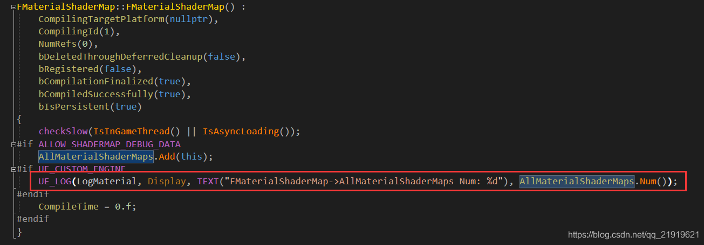

# 分析场景打包过程

[Windows.mk](https://github.com/OpenHUTB/carla/blob/3a71d4782a31b747968216e10f7993d0a0d7f453/Util/BuildTools/Windows.mk#L30) ：依赖PythonAPI，执行`Package.bat --ue-version 4.26 --all`
-> Package.bat

1.参数解析

2.获取虚幻引擎根路径

3.设置打包的路径（包括生成压缩包的完整路径 [carla/Build/UE4Carla/CARLA_0.9.15-262-g8f7e40f3c-dirty.zip](https://github.com/OpenHUTB/carla/blob/3a71d4782a31b747968216e10f7993d0a0d7f453/Util/BuildTools/Package.bat#L112) ），它根据`git describe --tags --dirty --always`命令生成压缩包的名称，
```shell
--tags  匹配远程的tag
--dirty  表示如果源码如果被修改了，则会在版本后面加上 -dirty
--always 获取最近的 commitID
```

4.创建Carla包

4.1编辑`Unreal/CarlaUE4/CarlaUE4.uproject`文件来启用/禁用CarSim插件

4.2通过`Build.bat`基于`Development`、`%PACKAGE_CONFIG%`配置进行编译

4.3通过 [`RunUAT.bat`](https://github.com/OpenHUTB/UnrealEngine/blob/OpenHUTB/Engine/Build/BatchFiles/RunUAT.bat) （Unreal Automation Tool，虚幻自动化工具）烘焙并打包 （报错地方）


5.给包中添加额外的文件，包括PythonAPI等

6.压缩项目

7.移除临时的中间文件

8.烘焙其他包

## RunUAT.bat [打包命令解析](https://blog.csdn.net/ttod/article/details/135868749)
查看`构建烘焙运行`命令`BuildCookRun`的帮助信息：
```shell
%UE4_ROOT%\Engine\Build\BatchFiles\RunUAT.bat BuildCookRun -Help
```
所使用到的命令含义：

| 命令                                                        | 描述                  |
|-----------------------------------------------------------|---------------------|
| `-Platform=Win64`                                         | 目标平台为Windows        |
| `-nop4`                                                   | 不使用Perforce版本控制     |
| `-project="%ROOT_PATH%Unreal/CarlaUE4/CarlaUE4.uproject"` | 目标UE项目工程文件          |
| `-build -cook -stage -archive -package`                           | 表示需要 构建、烘焙、暂存、归档、打包 |
| `-archivedirectory="!BUILD_FOLDER!"`                      | 归档输出目录              |
| `-clientconfig=%PACKAGE_CONFIG%`                      | 客户端编译配置，如Debug/Development/Shipping等              |


### 附录说明
自动化工具（Unreal Automation Tool，简称 UAT），自动化工具使用特定的命令 BuildCookRun

封装流程包含

| 命令                  | 描述               |
|---------------------|------------------|
| 构建（build）           | 该阶段将为所选择的平台编译可执行文件     |
| 烘培（cook）            | 该阶段通过在特殊模式下执行编辑器来转化内容     |
| 暂存（stage）           | 该阶段将可执行文件和内容复制到暂存区，它是开发目录以外的独立目录     |
| 打包（package、archive） | 该该阶段将项目打包成平台原生的分发格式     |
| 部署（deploy）          | 该阶段将构建版本部署到目标设备     |
| 运行（run）             | 该阶段在目标平台上启动已封装的项目     |

## 调试

最终运行的命令为：
```shell
"C:\workspace\UnrealEngine\Engine\Build\BatchFiles\RunUAT.bat"        BuildCookRun        -nocompileeditor        -TargetPlatform=Win64        -Platform=Win64        -installed        -nop4        -project="C:/workspace/carla/Unreal/CarlaUE4/CarlaUE4.uproject"        -cook        -stage        -build        -archive        -archivedirectory="C:/workspace/carla/Build/UE4Carla/1.0-7-gd8d6d49e0/"        -package        -clientconfig=Shipping
```

实际运行的**构建**命令（成功）：
```shell
Running: C:\workspace\UnrealEngine\Engine\Binaries\DotNET\UnrealBuildTool.exe UnrealPak Win64 Development -Project=C:\workspace\carla\Unreal\CarlaUE4\CarlaUE4.uproject  C:\workspace\carla\Unreal\CarlaUE4\CarlaUE4.uproject -NoUBTMakefiles  -Manifest=C:\workspace\UnrealEngine\Engine\Intermediate\Build\Manifest.xml -NoHotReload -log="C:\workspace\UnrealEngine\Engine\Programs\AutomationTool\Saved\Logs\UBT-UnrealPak-Win64-Development.txt"
```

实际运行的**烘焙**命令（失败）：
```shell
Running: C:\workspace\UnrealEngine\Engine\Binaries\Win64\UE4Editor-Cmd.exe C:\workspace\carla\Unreal\CarlaUE4\CarlaUE4.uproject -run=Cook  -TargetPlatform=WindowsNoEditor -fileopenlog -unversioned -abslog=C:\workspace\UnrealEngine\Engine\Programs\AutomationTool\Saved\Cook-2025.05.23-14.23.04.txt -stdout -CrashForUAT -unattended -NoLogTimes
```

解决：使用Carla配置打包时，移除 [DReyeVR的C++代码](https://github.com/OpenHUTB/carla/commit/a371032d40948ed788aed86252b22325ecac2bde) 可暂时规避，打包成功。

使用VR配置时，需要添加 [DReyeVR的C++代码](https://github.com/OpenHUTB/carla/commit/a371032d40948ed788aed86252b22325ecac2bde) ，可以打包成功，但是环境是黑色的，只有注视点的红色和方向盘的白色。

如果是用VR配置打包还失败，就是先要就编译器中独立程序运行后，然后安装RenderDoc，最后再打包。


## 找错过程
```shell
# 工作机
D:\work\workspace\UnrealEngine\Engine\Binaries\Win64\UE4Editor-Cmd.exe D:\work\workspace\carla\Unreal\CarlaUE4\CarlaUE4.uproject -run=Cook  -TargetPlatform=WindowsNoEditor -fileopenlog -unversioned -abslog=D:\work\workspace\UnrealEngine\Engine\Programs\AutomationTool\Saved\Logs\Cook-2025.05.23-14.23.04.txt -stdout -CrashForUAT -unattended -NoLogTimes
```

报错信息（ [相同报错](https://forums.unrealengine.com/t/ive-been-trying-to-package-my-project-for-more-than-a-weak-i-am-utterly-frustrated-and-i-dont-know-what-to-do/594421) ：说是.ini 的问题）：
```shell
LogWindows: Error: === Critical error: ===
LogWindows: Error:
LogWindows: Error: Fatal error!
LogWindows: Error:
LogWindows: Error: Unhandled Exception: EXCEPTION_ACCESS_VIOLATION reading address 0x0000000000000038
LogWindows: Error:
LogWindows: Error: [Callstack] 0x00007ffaedb266c4 UE4Editor-RenderCore.dll!FShaderMapContent::GetOutdatedTypes() [D:\work\workspace\UnrealEngine\Engine\Source\Runtime\RenderCore\Private\ShaderMap.cpp:581]
LogWindows: Error: [Callstack] 0x00007ff954f8b28a UE4Editor-Engine.dll!FMaterialShaderMap::GetAllOutdatedTypes() [D:\work\workspace\UnrealEngine\Engine\Source\Runtime\Engine\Private\Materials\MaterialShader.cpp:1043]
LogWindows: Error: [Callstack] 0x00007ff955413b67 UE4Editor-Engine.dll!GetOutdatedShaderTypes() [D:\work\workspace\UnrealEngine\Engine\Source\Runtime\Engine\Private\ShaderCompiler\ShaderCompiler.cpp:4216]
LogWindows: Error: [Callstack] 0x00007ff955433d03 UE4Editor-Engine.dll!RecompileShadersForRemote() [D:\work\workspace\UnrealEngine\Engine\Source\Runtime\Engine\Private\ShaderCompiler\ShaderCompiler.cpp:5129]
LogWindows: Error: [Callstack] 0x00007ff94d841c5d UE4Editor-UnrealEd.dll!UCookOnTheFlyServer::SaveGlobalShaderMapFiles() [D:\work\workspace\UnrealEngine\Engine\Source\Editor\UnrealEd\Private\CookOnTheFlyServer.cpp:5511]
LogWindows: Error: [Callstack] 0x00007ff94d8459dc UE4Editor-UnrealEd.dll!UCookOnTheFlyServer::StartCookByTheBook() [D:\work\workspace\UnrealEngine\Engine\Source\Editor\UnrealEd\Private\CookOnTheFlyServer.cpp:6865]
LogWindows: Error: [Callstack] 0x00007ff94d6843b9 UE4Editor-UnrealEd.dll!UCookCommandlet::CookByTheBook() [D:\work\workspace\UnrealEngine\Engine\Source\Editor\UnrealEd\Private\Commandlets\CookCommandlet.cpp:919]
LogWindows: Error: [Callstack] 0x00007ff94d6ae428 UE4Editor-UnrealEd.dll!UCookCommandlet::Main() [D:\work\workspace\UnrealEngine\Engine\Source\Editor\UnrealEd\Private\Commandlets\CookCommandlet.cpp:624]
LogWindows: Error: [Callstack] 0x00007ff77ab596da UE4Editor-Cmd.exe!FEngineLoop::PreInitPostStartupScreen() [D:\work\workspace\UnrealEngine\Engine\Source\Runtime\Launch\Private\LaunchEngineLoop.cpp:3369]
LogWindows: Error: [Callstack] 0x00007ff77ab50e6d UE4Editor-Cmd.exe!GuardedMain() [D:\work\workspace\UnrealEngine\Engine\Source\Runtime\Launch\Private\Launch.cpp:127]
LogWindows: Error: [Callstack] 0x00007ff77ab511ca UE4Editor-Cmd.exe!GuardedMainWrapper() [D:\work\workspace\UnrealEngine\Engine\Source\Runtime\Launch\Private\Windows\LaunchWindows.cpp:137]
LogWindows: Error: [Callstack] 0x00007ff77ab64e5d UE4Editor-Cmd.exe!WinMain() [D:\work\workspace\UnrealEngine\Engine\Source\Runtime\Launch\Private\Windows\LaunchWindows.cpp:268]
LogWindows: Error: [Callstack] 0x00007ff77ab66f02 UE4Editor-Cmd.exe!__scrt_common_main_seh() [D:\a\_work\1\s\src\vctools\crt\vcstartup\src\startup\exe_common.inl:288]
LogWindows: Error: [Callstack] 0x00007ffb52ed7374 KERNEL32.DLL!UnknownFunction []
LogWindows: Error: [Callstack] 0x00007ffb54edcc91 ntdll.dll!UnknownFunction []
LogWindows: Error:
LogWindows: Error: end: stack for UAT
```

### [调试配置](https://zhuanlan.zhihu.com/p/534528937)

**1.打开项目的 VS 工程**

打开工程下的 sln 文件（carla/Unreal/CarlaUE4/CarlaUE4.sln）以通过 VS 打开工程。

**2.在需要的地方下断点**

根据报错信息，在`UnrealEngine\Engine\Source\Runtime\RenderCore\Private\ShaderMap.cpp:581`打断点（也可以在任何想要调试的地方下断点）。

**3.选择合适的 VS 配置**

确认选择合适的配置（Development Editor）、平台（Win64）和启动工程（CarlaUE4）等。

**4.打开工程的属性配置界面**

在解决方案视图（Solution Explorer）中的工程名字上右键，点击属性（Properties）。

此时会打开对应工程的属性页面（Property Pages）；

点击配置属性（Configuration Properties） 下的调试（Debugging） 标签；

在命令参数（Command Arguments）中输入对应的 Cook 命令，在原有的命令后添加：
```shell
-run=Cook  -TargetPlatform=WindowsNoEditor -fileopenlog -unversioned -abslog=D:\work\workspace\UnrealEngine\Engine\Programs\AutomationTool\Saved\Logs\Cook-2025.05.23-14.23.04.txt -stdout -CrashForUAT -unattended -NoLogTimes
```

附 Cook 命令格式：
```shell
-run=cook -targetplatform=<Plat1>+<Plat2> [-cookonthefly] [-iterate] [-map=<Map1>+<Map2>]
```

点击确定或应用，属性页面会自动关闭。

**5.开始调试**

点击 Debug - Start Debugging ，或直接按 F5 等，启动调试。

通过对堆栈和属性等或其它操作进行正常的分析调试。

注意!!!
    需要重新运行 make package，不能在vs中只运行之前的烘焙命令，否则不会显示所做修改的日志。

根据最后一个出错的id，加1后获得烘焙出错的资产
```shell
LogMaterial: Display: GetAllOutdatedTypes->AllMaterialShaderMaps Index = 219
```

```shell
  LogMaterial: Display:  CacheShadersForResources->BaseMat:ProceduralHairCardsShader,Ins:MI_cardsShader_hairEyebrowsLOD1
  LogMaterial: Display: FMaterialShaderMap->AllMaterialShaderMaps Num: 220
```

把不兼容的材质全删除。

材质的报错信息为（ [特性关卡ES3_1不支持光照模型MSM_Hair](https://forums.unrealengine.com/t/node-not-supported-in-feature-level-es2/46847/4) ）：
```shell
ShadingModel MSM_Hair not supported in feature level ES3_1
```
正在使用 [OpenGL ES (Embedded Systems)](https://zh.wikipedia.org/wiki/OpenGL_ES) 3.1 的特性集（编辑器->项目设置->平台->Windows-> [Support OpenGL ES3.1 勾选](https://blog.csdn.net/Tokyo_2024/article/details/102945710) 了，为Android扩展，在Windows平台上运行可以不需要，取消勾选即可）。


## 增加烘焙提示信息

1.当项目打包时，cook出错，但是从原始引擎提供的信息中，没有提示具体的那个资源出错，要查到出错资源，还是非常麻烦。

2.下面就材质cook出错，增加一些日志，方便查找问题做简单记录

3.材质cook的一个阶段，是收集MaterialShaderMap,如果在这个阶段收集的信息出错，将会在FShaderMapContent::GetOutdatedTypes函数中，因为Shaders指针指向的内存有问题而出错，通过断点发现，FShaderMapContent这个类对象指针为null，而这个类对象的来源于AllMaterialShaderMaps中，但是通过纯断点调试，发现FMaterialShaderMap::GetAllOutdatedTypes这个函数是多线程运行，所以查看变量的值可能会错乱，所以通过 [增加日志](https://github.com/OpenHUTB/UnrealEngine/blob/08349c14cdd78e358bb92dcef63f20f5fd0c2cf4/Engine/Source/Runtime/Engine/Private/Materials/MaterialInstance.cpp#L2900) 的方式，永久性解决这一问题

4.首先在UMaterialInstance::CacheShadersForResources函数中，添加材质实例母材质名字日志


5.然后在AllMaterialShaderMaps.Add处，[打印AllMaterialShaderMaps的个数](https://github.com/OpenHUTB/UnrealEngine/blob/08349c14cdd78e358bb92dcef63f20f5fd0c2cf4/Engine/Source/Runtime/Engine/Private/Materials/MaterialShader.cpp#L2357) ，可以通过这个个数判断打印的母材质实例名字这条信息对应的AllMaterialShaderMaps中的索引值



6.最后修改FMaterialShaderMap::GetAllOutdatedTypes中的实现，并 [打印当前执行的AllMaterialShaderMaps的索引值](https://github.com/OpenHUTB/UnrealEngine/blob/08349c14cdd78e358bb92dcef63f20f5fd0c2cf4/Engine/Source/Runtime/Engine/Private/Materials/MaterialShader.cpp#L1048) ，当在该函数出错时，将会打印出出错的索引


7.如何判断：通过出错的索引 + 1，在日志中去找【FMaterialShaderMap->AllMaterialShaderMaps Num：】这条日志;通过该信息，寻找附近【CacheShadersForResources->BaseMat】日志，该日志会定位出错的母材质和材质实例


```shell
LogMaterial: Warning: [AssetLog] C:\workspace\carla\Unreal\CarlaUE4\Content\Carla\Static\GenericMaterials\Pedestrian_Shaders\Hair_\MI_DHair_MASTER_Inst_v8afro.uasset: Failed to compile Material Instance with Base M_DHair_MASTER for platform PCD3D_ES31, Default Material will be used in game.
LogMaterial: Display:         ShadingModel MSM_Hair not supported in feature level ES3_1

[2025.06.20-07.22.28:311][  0]LogMaterial: Display: FMaterialShaderMap->AllMaterialShaderMaps Num: 102
[2025.06.20-07.22.28:319][  0]LogMaterial: Display: Missing cached shader map for material M_CarDetails_Master_Tagged4, compiling. 
```

!!! 注意
    以上日志的对应关系，是通过断点查变量值，对比变量地址得来的


### [定义自定义引擎](https://forums.unrealengine.com/t/custom-engine-macro/373200)

将 USE_CUSTOM_ENGINE 定义添加到 Engine/Source/Runtime/Core/Public/Misc/Build.h。


## 参考

* [查cook资源失败](https://blog.csdn.net/qq_21919621/article/details/109162074)
* [基于 VS Debug 的 UE4 打包问题调查方案（成功）](https://zhuanlan.zhihu.com/p/534528937) 
* 打包脚本 [Package.bat](https://github.com/OpenHUTB/carla/blob/OpenHUTB/Util/BuildTools/Package.bat)
* [UE4如何调试BuildCookRun](https://blog.csdn.net/sinat_23135151/article/details/140663928)
* [编辑器内正常运行但打包出错](https://blog.csdn.net/charon8778/article/details/141339988)
* [调试UAT](https://blog.csdn.net/sinat_23135151/article/details/140663928)
* [ue4烘焙失败](https://blog.csdn.net/luofeixiongsix/article/details/81014953)


